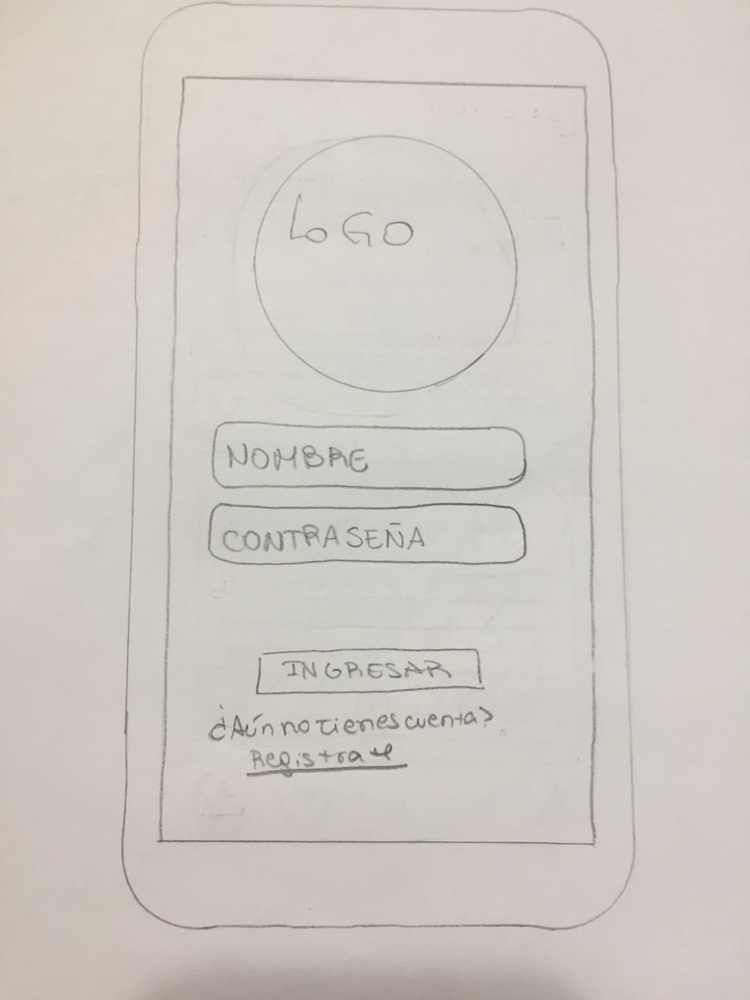
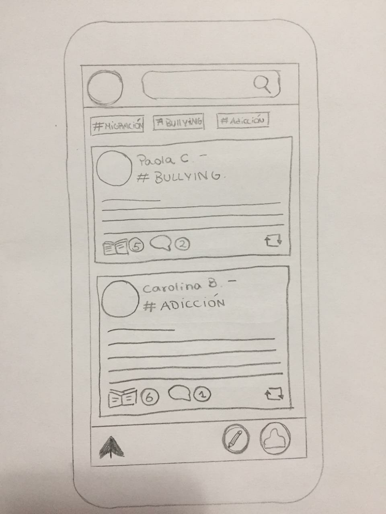
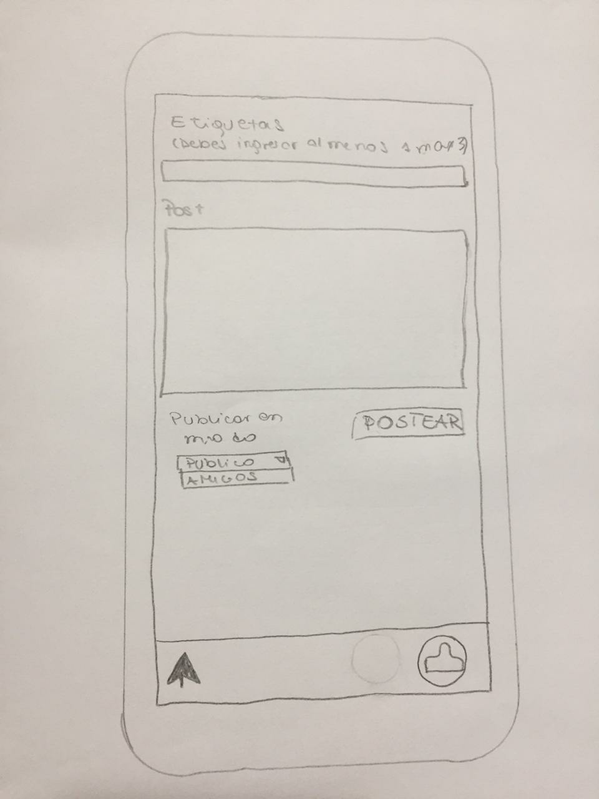
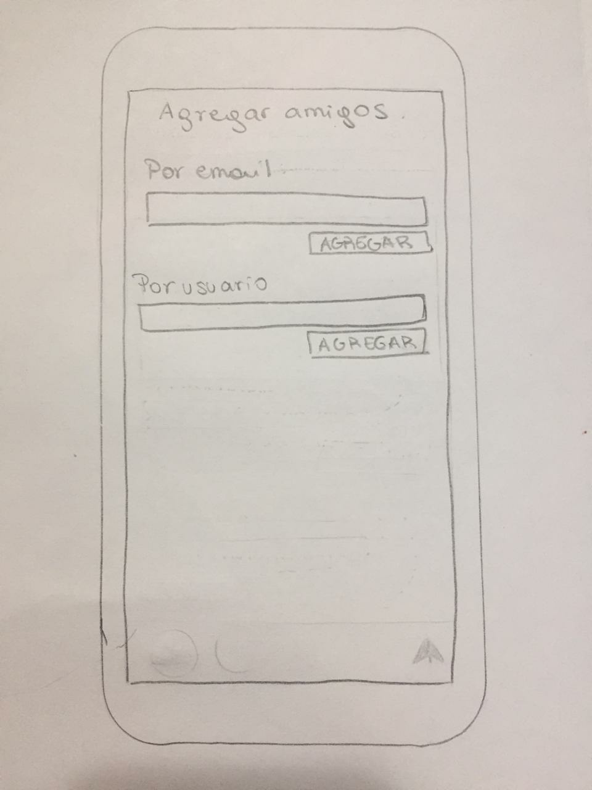

# TEACHER'S SCHOOL

## **Introducción**

Es un apalicación que esta dirigida pricipalmente a Profesores de diferentes especialidades con la finalidad de generar la instancia donde puedan aclarar dudas, orientarse en temas dificiles de abordar, buscar profesores de su misma disciplina con el objetivo de ver temas de caracter educativo. 

De esta manera les brindamos una facilidad al momento que tienen que organizar una actividad o dinamica para sus estudiantes y no saben como abordarla, basandose en la experiencia de otros profeisonales. Por ejemplo: Si una Profesora de Orientación quiere abordr un tema sobre sexualidad y no sabe cómo, puede recurrir a esta aplicación preguntando directamente a los usuarios o buscando por "tag" sobre el tema y ver los contenidos que ya se han abordado, de esta manera además ahorran tiempo (que para ellos es muy escaso, dada al poco tiempo que tienen).

## **Ideación de Diseño**

Para definir el diseño de nuestra Red Social comenzamos a revizar la interfaz de usuario de distintas redes sociales como Facebook, Twitter e Instagram. 

### **Entrevista**  

Se realizó una encuesta a seis profesobres de dintista disciplina, les explicamos la aplicación que tenemos pensado hacer y les parece muy interesante porque ninguno conoce una aplicación que este dirigida principalmente a ellos.

### **Historia de usuario**

**Historia Nº 1**

Cómo: Profesora Jefe de un curso de enseñanza media.

Quiero: Un espacio donde poder compartir tips sobre temas difíciles de abordar en el aula.

Para: Planificar de mejor manera la clase.

**Historia Nº 2**

Cómo: Profesora de orientación.

Quiero: Crear un post para pedir orientacion a otros profesores sobre un tema.

Para: Abordar de mejor manera la clase con los alumnos.

**Historia Nº 3**

Como: Profesor de básica.

Quiero: Filtrar un tema específico.

Para: que aparezca las publicaciones sobre este tema que se han realizado en la aplicación.

**Historia Nº 4**

Cómo: Profesor.

Quiero: Agregar colegas de mi misma especialidad.

Para: ver sus publicaciones y/o poder contactarlos.

### **Prototipo de baja de nuestra Red Social!**

El prototipo de esta página consta de 4 pantallas. La primera es donde el usuario debe iniciar sesión, que puede ser con una cuenta creada desde la aplicación, mediante su cuenta de gmail o de Facebook, en caso que no éste registrado y no quiere iniciar sesión desde las dos ultimas plataformas, hay un link que dice "registrate aquí" y se abre otra pantalla donde puede ingresar sus datos y crear su cuenta con clave.

Una vez registrado o iniciado sesión se abre otra pantalla que es la pagina principal de nuestra red social, donde puede ver las publicaciones de otros usuarios, en la parte superior hay un buscador donde damos la opción al usuario buscar post por temas de su interes. Los post se pueden comentar y dar "likes" y el profesor que emitio su post puede eliminar y editarlo, lo mismo para los comentarios. En la parte inferior aparecen tres imagenes/simbolos: flecha hacia arriba (damos la opción de volver al inicio de las publicaciones rapidamente una vez que el usuario haya visto diversos post y a bajado bastante,de esta manera se ahorra tiempo), lapiz (con este simbolo se puede crear un post) y una persona (al hacer click se despliega una columna donde puede ver su perfil, buscar amigos y cerrar sesión).

Al hacer click en el lapiz, aparece otra pantalla donde puede emitir el post, en la parte superior de esta sección hay una campo donde debe señalar el "tag"/tema de su post para que otros usuarios que buscan un tema especifico puedan encontrarlo. Luego debe seleccionar si su post será publico o privado (sólo para amigos de su red). El tercer paso es emitir el post y al terminar debe hacer click en "publicar".

Si el usuario quiere buscar amigo debe haer "click" en la parte inferior de la aplicación, luego en la opción buscar amigos y se abrira otra pantalla donde podrá concretar la acción.

En esta imagen se muestra el inicio de nuestra aplicación donde el usuario debe iniciar sesión

 

Aquí se ve como sería nuestra pagina principal

En la siguiente imagen se ve como sería la sección para crear un nuevo post

En ésta ultima se ve como sería la sección para buscar amigos.

### **Prototipo de alta de nuestra pagina Pokego!**

Luego de testar y analizar nuestro prototipo de baja, diseñamos nuestro prototipo de alta en Figma y lo exportamos a Zeplin.

[Ver prototipo en alta en Figma](https://www.figma.com/file/NZ8W3KBrc3oz3UcEUSb8PIuo/PokeGO?node-id=0%3A1)

[Exportación del proyecto de Figma a Zeplin](https://zpl.io/29oOzrw)

El prototipo en alta fue testeado y grabado:

[Video uno de testeabilidad](https://github.com/AnaGalvezSalas11/scl-2018-12-bc-core-data-lovers/blob/master/src/Videos%2C%20testeo%20de%20pagina%20en%20alta/Diego.mp4)

[Video dos de testeabilidad](https://github.com/AnaGalvezSalas11/scl-2018-12-bc-core-data-lovers/blob/master/src/Videos%2C%20testeo%20de%20pagina%20en%20alta/Nicolas.mp4)

Las observaciones que tuvimos de los usuarios frente a nuestro prototipo de pagina web fue:

* Que en el reloj donde damos a conocer el listado de pokemon, debieramos dar la opción de conocer la ficha descroptiva de cada uno de ellos al hacer click (como en la pantalla 2)

* Que en la ficha descriptiva de cada pokemon indicar de que manera es la evolución por pokemon.

* Les gustó que las debilidades aparezcan en colores (más visual) que solo nombrarlos.

 
Paleta de colores usada en la interfaz:

### **Flujo interactivo de PokeGO!**

### **Planificación en Trello**

[Trello PokeGO!](https://trello.com/b/J9VDuFEc/pokemon-go)

